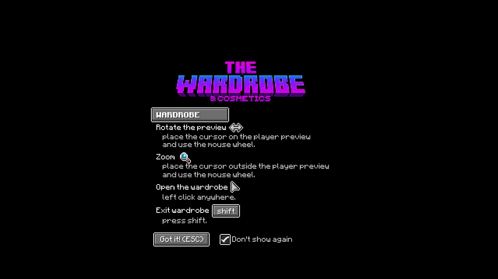
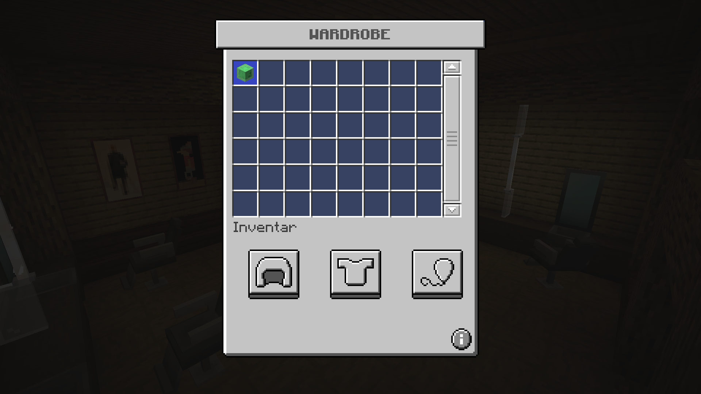
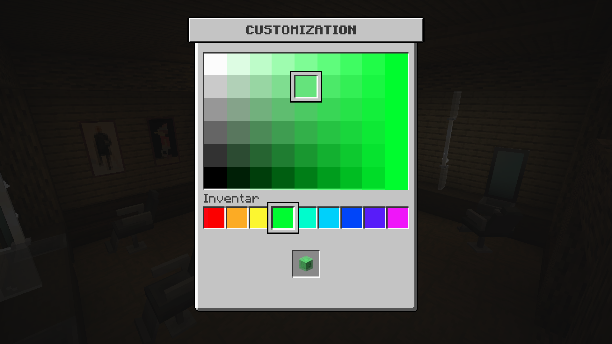

# CCVanillaUI

This project aims at changing the textures used by [CosmeticsCore] to be more vanilla-like in their appearances, wherever possible.

The pack currently affects the following assets:

- GUI:
    - Main Wardrobe GUI
    - Color select GUI
    - Cosmetic Buttons
    - Color select Icon
- Wardrobe Tutorial Screen
- Cursors
    - Pointer (Hand)
    - Scroll (Arrows)

## Installation

1. Download the latest available Zip file from the [Releases Tab][releases].
2. Extract the Assets.
3. Move the files from `z_cosmetics` into the `z_cosmetics` folder of where you're hosting the CosmeticsCore assets.
    - ItemsAdder: `/plugins/ItemsAdder/contents/cosmetics/resourcepack/assets/z_cosmetics/`
    - Anything else: Check for the `z_cosmetics` folder.
4. You may get asked if you want to override the existing files. Confirm this.
5. Update your resource pack. This depends on how it gets generated.

## Previews

 form")
 form")

<!-- Links -->
[CosmeticsCore]: https://www.spigotmc.org/resources/105324/
[releases]: https://github.com/Andre601/CCVanillaUI/releases/_latest
